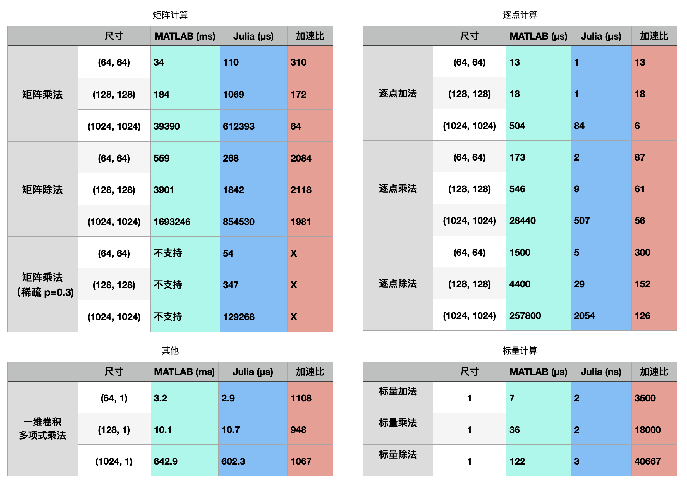

> This package is a part of Tongyuan's product. This repo is an archived version of it for the
  purpose of JuliaCN 2022 talk ["Why I still recommend Julia -- composability and generic
  programming"](https://cn.julialang.org/meetup-website/2022/).
> This package provides a live example on how Julia beats MATLAB's C code by 1000x faster. The case
  is special, but the spirit that drives its design are common in Julia.



# GaloisFieldNumbers.jl

This package provides a core integer type `GF`(aka `GFNumber`) to represent numbers in the
galois field.

## Construction

The main constructor is `GF{M}`, where `M` represents the number of bits(capacity). For instance,
numbers in field `GF{3}` is between `GF{3}(0)` and `GF{3}(2^3 - 1)`.

```julia
julia> typemin(GF{3}), typemax(GF{3})
(GF3(0), GF3(7))

julia> x = GF{3}(3) # is equivalent to GF3(3)
GF{3}(3)

julia> capacity(x), ppoly(x), eltype(x)
(3, GF3(11), UInt64)
```

The full constructor version is `GF{M,P,T<:Unsigned}(x)`, where `M` represents the field capacity, `P` is the chosen prime polynomial for this galois field (default value is the smallest one), and
`T` is the raw data type. These information can be extracted using `capacity`, `ppoly` and `eltype`, respectively.

For convenience, some alias are made for commonly used valid `M` value -- from `GF1` to `GF16`. The
difference between `GF3` and `GF{3}` is that `GF3` is a concrete type with `P=11` and `T=UInt`,
while `GF{3}` is a partially constructed type (neither concrete or abstract). For instance,

```julia
julia> x = GF3[1, 2, 3] # equivalent to GF{3,11,UInt}[1, 2, 3]
3-element Vector{GF3}:
 1
 2
 3

julia> x = GF{3}[1, 2, 3]
3-element Vector{GFNumber{3}}:
 GF3(1)
 GF3(2)
 GF3(3)
```
